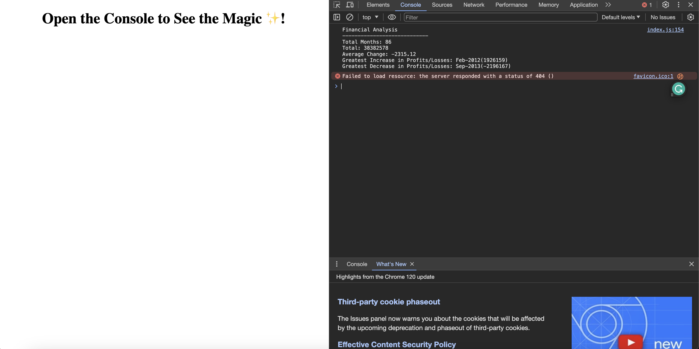

# JavaScript Console Finances

## Description

This project takes a list of profit and losses of a company over 86 months and produces a fact sheet, listing the net profit, the average change, and the greatest increase/decrease in profits/losses. I enjoyed working on this project and it helped me solidfy a lot of the concepts introduced in class, particularly how the for loop works.

## Installation

No installation necessary. Please visit https://alex-quayle.github.io/console-finances/ to view the webpage. Below is a screenshot of the deployed page:

## Credits

In addition to the following links, the class sessions held by the edX front-end bootcamp team have represented most of my understanding of JavaScript. I also have some previous experience with Java, which has in some places helped me understand JavaScript.

> Mozilla Developers Network (2023, September 12). Character escape: \n, \u{...}. https://developer.mozilla.org/en-US/docs/Web/JavaScript/Reference/Regular_expressions/Character_escape.

> Jones., D. (2022, September 14). A Guide to Rounding Numbers in JavaScript. https://www.sitepoint.com/rounding-numbers-javascript/.

> Chima Atuonwu., S. (2020, April 2). Var, Let, and Const – What's the Difference?. https://www.freecodecamp.org/news/var-let-and-const-whats-the-difference/.
